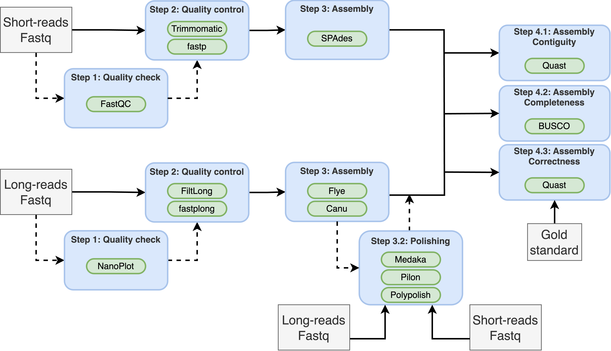

For this assignment, we will perform de novo assembly of a bacterial genome from *Escherichia coli* using three different technologies: Illumina, Nanopore and PacBio. The specific strain is *E. coli* O127:H6 (strain E2348/69). The files used for the assignment and their SRA accession are summarized in the following table:

| Organism | Library | SRA accession |
| :--- | :--- | :--- |
| *E. coli* | ONT Rapid | SRR11523179 |
| *E. coli* | ONT Ligation | SRR11434959 |
| *E. coli* | ONT Ligation (no size selection) | SRR12801740 |
| *E. coli* | Pacbio Sequel II CLR | SRR11434960 |
| *E. coli* | Pacbio Sequel II HiFi | SRR11434954 |
| *E. coli* | Illumina HiSeq4000 | SRR11434958 |

The original reference paper for this dataset:

* Eric S Tvedte, Mark Gasser, Benjamin C Sparklin, et al. Comparison of long-read sequencing technologies in interrogating bacteria and fly genomes, G3 Genes|Genomes|Genetics, Volume 11, Issue 6, June 2021, jkab083, https://doi.org/10.1093/g3journal/jkab083

The authors provide a well-curated and visually validated assembly combining multiple technologies. We will use that assembly as our gold standard to compare the different assemblies.

We will compare the characteristics and SNP calls for three sequencing technologies: Illumina, PacBio HiFi, and Nanopore.

# Learning objectives
At the end of this week's assignment you will be able to:

1. Understand the concept of genome assembly and contig
2. Learn the basic assembly algorithms for short- and long-reads
3. How to run a short-read assembler on Illumina data
4. How to run a long-read assembler on PacBio HiFi and ONT data
5. How to polish and improve the accuracy of assemblies
6. How to perform hybrid assembly
7. Understands the applications of genome assembly
8. Metrics for assembly quality assessment

# Input and outputs
The input for this assignment are the fastq files generated by:

* Illumina paired end data (SRR11434958)
* PacBio HiFi (SRR11434954)
* PacBio CLR (SRR11434960)
* ONT Rapid Library Prep (SRR11523179)
* ONT ligation library prep (SRR11434959)
* ONT ligation library prep without size selection or shearing (SRR12801740)

> Illumina files:
>
> `/project2/msalomon_1816/trgn_515/4_assembly/illumina/fastq`

> PacBio files:
>
> `/project2/msalomon_1816/trgn_515/4_assembly/pacbio/fastq`

> Nanopore files:
> 
> `/project2/msalomon_1816/trgn_515/4_assembly/ont/fastq`

> Benchmarking file:
> 
> `/project2/msalomon_1816/trgn_515/4_assembly/benchmark/GCF_014117345.2_ASM1411734v2_genomic.fna.gz`

The original dataset can be found in the following publication:

* Eric S Tvedte et. al. Comparison of long-read sequencing technologies in interrogating bacteria and fly genomes, G3 Genes|Genomes|Genetics, Volume 11, Issue 6, June 2021, jkab083, https://doi.org/10.1093/g3journal/jkab083


# Required software
<!-- In order to complete the assignment, the following tools need to be installed:

```sh
mamba install bioconda::trimmomatic
mamba install bioconda::filtlong
mamba install bioconda::fastp
mamba install bioconda::fastqc
mamba install bioconda::nanoplot
mamba install bioconda::spades
mamba install bioconda::flye
mamba install bioconda::canu
mamba install bioconda::pilon
mamba install bioconda::polypolish
mamba install bioconda::masurca
mamba install bioconda::unicycler
conda install bioconda::quast
mamba install bioconda::busco=5.8.2
mamba install bioconda::csvtk

module load htslib
module load bcftools
module load samtools
``` -->

All the required software is available by loading the following conda environment:

```sh
# For all software
conda activate /project2/msalomon_1816/trgn_515/conda_env/trgn515
```

Some software will have its own conda environment, which I will indicate in each subsection.

We will perform the following assemblies:

# Bioinformatics workflow

1. Illumina
<!-- 2. ONT Rapid kit +/- long-read polishing -->
3. ONT Ligation kit +/- long-read polishing
<!-- 4. ONT Ligation kit without size selection +/- long-read polishing -->
5. PacBio HiFi
6. Hybrid Illumina + ONT Ligation kit
7. ONT Ligation kit + short-read polishing

{style="display: block; margin: 0 auto"}


# Sequencing technologies and library preparation

The sequencing technology and library preparation have an impact on read length and quality, and sometimes some library preparations may be preferred for specific experiments. Some of the library preparation steps that may impact the results of whole-genome sequencing include:

* Fragmentation - The protocol followed to fragment the DNA have an impact on read length distribution. Common protocols include enzymatic fragmentation, mechanical shearing (e.g: sonication) or tagmentation (using transposomes)
* Size selection - Many protocols benefit from size selection, and it's often included in Nanopore ligation protocols and PacBio. This may have an impact in our ability to detect plasmids, for example, if the size selection is only keeping reads longer than the plasmid
* Adapter ligation - Adapters can be added in multiple ways. Most notably, they can be ligated at the end of the DNA fragments (Illumina, ONT ligation or PacBio), or added by an enzyme called transposase that randomly cuts the DNA while adding adapters (ONT Rapid Kit)
* PCR amplification - Some sequencing technologies, like Illumina, often include a PCR step. For ONT or PacBio, this step is optional. PCR may introduce bias in amplification and enrich sequences differentially.


### Task 1: Compare raw read statistics between sequencing technologies and library preparation protocols.
::: {.callout-note}
Get a random sample of 200,000 reads for each sample summarized in Table 1. For Illumina, use only the forward reads. Report the following metrics:

* Read length
* Average Base quality per read
* GC content per read

1. Plot a histogram of each of the three metrics. Plot all samples together, each metric in a different plot, for a total of 3 plots **(10pts)**
2. Is there any difference in read length, base quality and GC content between library preparations for ONT? If so, what is causing these differences? **(10pts)**
3. Is there any difference in read length, base quality and GC content between library preparations for PacBio? If so, what is causing these differences? **(10pts)**
:::

# Short-read genome assembly

For the Illumina data, we will perform genome assembly using the Spades assembler. As seen in class, short-read assemblies rely on dividing the short-reads into k-mers. Choosing k-mer and other parameters can be tricky and many assemblers (including spades) will automatically select values for its parameters based on the input data. Also, Spades allows the user to select multiple k-mer sizes to maximise the chance of finding an ideal assembly. For this data, I propose using k-mer sizes of 21, 33, 55, 77, and 101bp. You can also use different k-mers or let Spades decide by not using the `-k` flag.

```sh
kmers=21,33,55,77,101

spades.py
-o <out_dir> # Output directory
-1 <fwd.fastq> # Forward reads
-2 <rev.fastq> # Reverse reads
--isolate # Isolate mode (recommended for single species with high coverage )
-t $SLURM_CPUS_PER_TASK # Multithreading
-k $kmers # Kmer size (skip for automatic selection)
```

**NOTE:** This command took 40 minutes and peak memory usage of 200mb in the cluster

Spades outputs contigs with consistent headers that include information regarding contig length and contig coverage (number of reads included in the contig). An example of contig header for a contig of 100,000bp in length and 100x coverage:

```
>NODE_1_length_100000_cov_100
```

This makes it very handy for filtering poor quality contigs using only the information from the header. You can filter using the following command:

```sh
seqkit fx2tab $contigs | 
csvtk mutate -H -t -f 1 -p "cov_(.+)" | 
csvtk mutate -H -t -f 1 -p "length_([0-9]+)" | 
awk -F "\t" '$4>=10 && $5>=1000' | # Only keep contigs with coverage higher or equal than 10 reads and length of at least 1000bp
seqkit tab2fx > $out_dir/$sample.filt_contigs.fa
```

# Long-read genome assembly

Long-reads from different sequencing technologies will have different base error profiles, and thus many general long-read assemblers will have different options. For instance, Flye has `--nano-raw` for old Nanopore reads and `--nano-hq` for newer chemestries and basecallers. Similarly, for PacBio the flag `--pacbio-raw` should be used for CLR reads while the flag `--pacbio-hifi` is the recommended one for HiFi reads. The assembly algorithm is the same, it just changes the expected sequencing error rate. To run Flye:

```sh
conda activate /project2/msalomon_1816/trgn_515/conda_env/medaka

flye
--nano-raw <in_reads.fq> # Use --nano-raw for nanopore, --pacbio-raw for CLR and --pacbio-hifi for HiFi
--threads $SLURM_CPUS_PER_TASK
--out-dir <output_dir>
```

For each of the ONT assemblies, we will also perform long-read assembly polishing. On this step, long-reads are mapped back to the assembled contigs, and any differences between the mapped reads and the contig will be resolved. We will use Medaka for this:

```sh
conda activate /project2/msalomon_1816/trgn_515/conda_env/medaka

medaka_consensus
-i <in_reads.fq> # Input long-reads
-d <in_assembly.fa> # Input assembly
-o  <output_dir>
-m <model> # Basecalling model

## Basecalling models:
# ONT Rapid and ONT ligation - r941_e81_hac_g514
# ONT Ligation (no shear) - r1041_e82_400bps_hac_v4.0.0
```

# Hybrid assembly - Polishing with short-reads

Long-read assemblies tend to be very contiguous, but they may contain small-scale errors such as single basepair erros and indels. The goal of short-read polishing is to fix these small-scale errors using Illumina reads. There are many short-read polishing tools, such as Polypolish, POLCA, Pilon, or Racon. For it's performance and simplicity, let's use the POLCA polisher with the Illumina short-reads:

```sh
polca.sh
-a <assembly.fasta> # Assembly to polish
-r "<short-reads_1.fq> <short-reads_2.fq>" # Short-reads. Make sure the list of read files are between quotes
-t "$SLURM_CPUS_PER_TASK" # Number of threads
```

POLCA creates a bunch of indexes and temporary files, and unsorts the contigs (not important, but annoying). We can remove temporary files and reorder contigs:

```sh
# Reorder contigs and remove newlines from sequences
seqtk seq <assembly.fasta>.PolcaCorrected.fa | paste - - | sort | tr '\t' '\n' > <sample>_polca.fasta

# Remove temporary files
rm *PolcaCorrected.fa *.amb *.ann *.bai *.bam *.batches *.bwt *.fai *.names *.pac *.report *.sa *.sam *.success *.vcf
```

# Hybrid assembly - Short reads first

Another type of hybrid assembly performs short-read assembly first, then bridges the gaps using long-reads. A widely-used software to perform this type of hybrid assembly is Unicycler. To run Unicycler:

```sh
conda activate /project2/msalomon_1816/trgn_515/conda_env/unicycler

unicycler -1 <short-reads_1.fq> -2 <short-reads_2.fq> -l <long_reads.fq> -o <out_dir>
```

# Genome assembly quality control

We typically measure the quality of an assembly using three factors:

* Contiguity: It measures how contiguous is the assembly, i.e: how many contigs are present and how long they are. 
* Completeness: It measures how much of the genome is missing in our assembly
* Correctness/Accuracy: It measures how accurate is the assembly.

## Contiguity

Assembly contiguity measures how contiguous or broken up is the assembly. A good assembly should have a low number of contigs but very long. Common metrics used to measure contiguity include N50, NG50, L50, LG50, number of contigs, mean contig length etc. QUAST is commonly used to get some of these metrics. You can provide all your assemblies at once to get a comparison:

```sh
quast.py *.fasta
-o <out_dir>
```

**NOTE:** No need to run this version of the code, we will run it later with additional options.

## Completeness

Assembly completeness measures of much of the assembly is missing. If there's a well-assembled reference genome, we can simply measures completeness by comparing it against it. Otherwise, a common way to measure completeness is by inferring the presence of conserved single-copy genes (core genes) in our assembly and comparing it the expectation given the assembly species. The most commonly used software for that is BUSCO (Benchmarking Universal Single-Copy Orthologs).

First, we start by downloading the dataset that BUSCO will use for the comparison. This is done for you, but the command for _E. coli_ would be:

```sh
busco --download bacteria
```

To run BUSCO on *E. coli*:

```sh
busco -i <assembly.fa> # Input assembly
-o <out_dir> # Output directory
-l bacteria_odb10 # Bacteria database. You can incude the full path if already downloaded
-m genome # Genome assembly
```

To get a comparison of the BUSCO results for all the samples, you need to first get all the BUSCO reports in one folder and then run their comparison script:

```sh
# Get all BUSCO summaries into one folder
for folder in *; do scp $folder/short_summary*txt; done
mkdir -p busco_summaries
mv short_summary.* busco_summaries/

# Generate comparison plot for all BUSCO results
generate_plot.py -wd busco_summaries
```

## Accuracy
The accuracy of the genome assembly is affected by how many mistakes the assembler makes. Assembly accuracy is determined by:

* Misassemblies (large-scale rearrangements)
* Consensus errors (mismatches, insertions or deletions)

Calculating the accuracy of an assembly typically requires the use of a reference genome. We can again use QUAST for this by giving it a reference genome:

```sh
quast.py
*.fasta # Assembly list
-r <reference_genome.fa> # Reference genome
-o <out_dir> # Output directory
```


### Task 2: Assessing assembly quality
::: {.callout-note}
The latest task consists of a comparison between the variant calls you obtained and the gold standard.

Compare the following assemblies:

* Illumina
<!-- * ONT Rapid kit
* ONT Rapid kit + long-read polishing -->
* ONT Ligation kit
* ONT Ligation kit + long-read polishing
<!-- * ONT Ligation kit without shearing
* ONT Ligation kit without shearing + long-read polishing -->
* PacBio HiFi
* Hybrid Illumina + ONT Ligation kit (Unicycler)
* ONT Ligation kit + short-read polishing (POLCA)


1) Interpret the Nx plot produced by QUAST. Explain the plot, the axes, what it shows and why is important **(5pts)**
2) What are the sequencing technologies that produce the most contiguous assembly? Does short-read or long-read sequencing produce the most contiguous contigs? **(5pts)**
3) What's the most accurate sequencing technology? **(5pts)**
4) Explain the BUSCO gene completeness plot. What's the plot showing?  **(5pts)**
5) Based on the BUSCO plot, what sequencing technologies produce the most complete assembly? **(5pts)**
6) Can an assembly with a bad Nx plot have a good BUSCO analysis result? Explain your answer **(10pts)**
<!-- 6) For an experiment, you want to perform genome assembly of a bacterial species that may contain a plasmid of 2000bp. The scientist asks you a few questions:    
    1. What sequencing technologies and library preparations will be able to sequence the plasmid? Why? **(5pts)**
    2. What sequencing technologies and library preparations will deliver the plasmid and the most contiguous assembly? Why? **(5pts)**
    3. Would there be any benefit on doing both Illumina and Nanopore? **(5pts)** -->
:::
